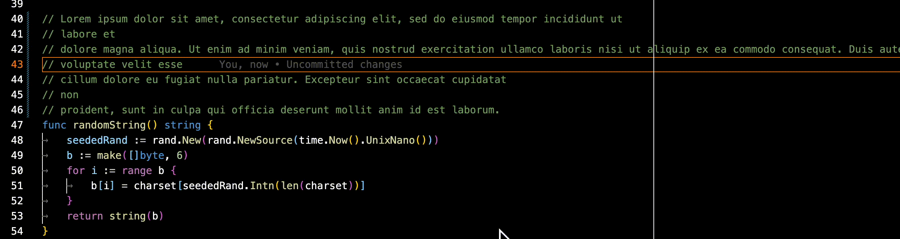

# WrapCom

[Available on Marketplace](https://marketplace.visualstudio.com/items?itemName=drewgonzales.wrapcom)

## Features

Hard wrap any long comment lines.

## Extension Settings

LineLength - default 80

This sets the desired line length. When rewriting comments, WrapCom will do it's best to ensure that the comment lines are less than 80 characters long, but will put as many words into a line as it can.
